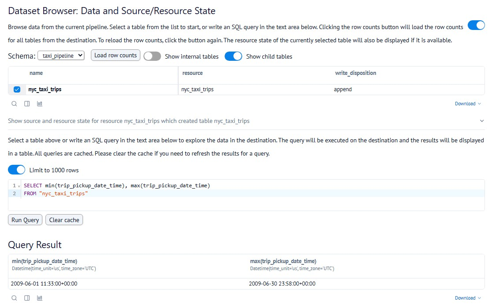
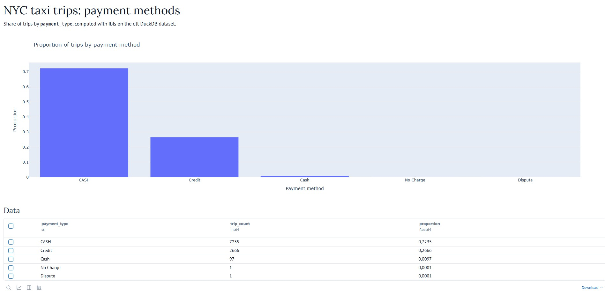
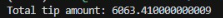

# Workshop DLT Homework: Build Your Own dlt Pipeline

## Question 1: What is the start date and end date of the dataset?

**Options:**
- 2009-01-01 to 2009-01-31
- ✅ **2009-06-01 to 2009-07-01** (Correct Answer)
- 2024-01-01 to 2024-02-01
- 2024-06-01 to 2024-07-01

**Solution:**
Using dlt Dashboard:

```bash
dlt pipeline taxi_pipeline show
```

<p align="center">
  
</p>


## Question 2: What proportion of trips are paid with credit card?

**Options:**
- 16.66%
- ✅ **26.66%** (Correct Answer)
- 36.66%
- 46.66%

**Solution:**
Using Marimo Notebook:

```bash
marimo edit taxi_payment_methods_app.py
```
<p align="center">
  
</p>


## Question 3: What is the total amount of money generated in tips?

**Options:**
- $4,063.41
- ✅ **$6,063.41** (Correct Answer)
- $8,063.41
- $10,063.41

**Solution:**
Using dlt MCP Server to request the agent to create a Python script to retrieve results from the duckdb database:

```bash
python query.py
```

<p align="center">
  
</p>